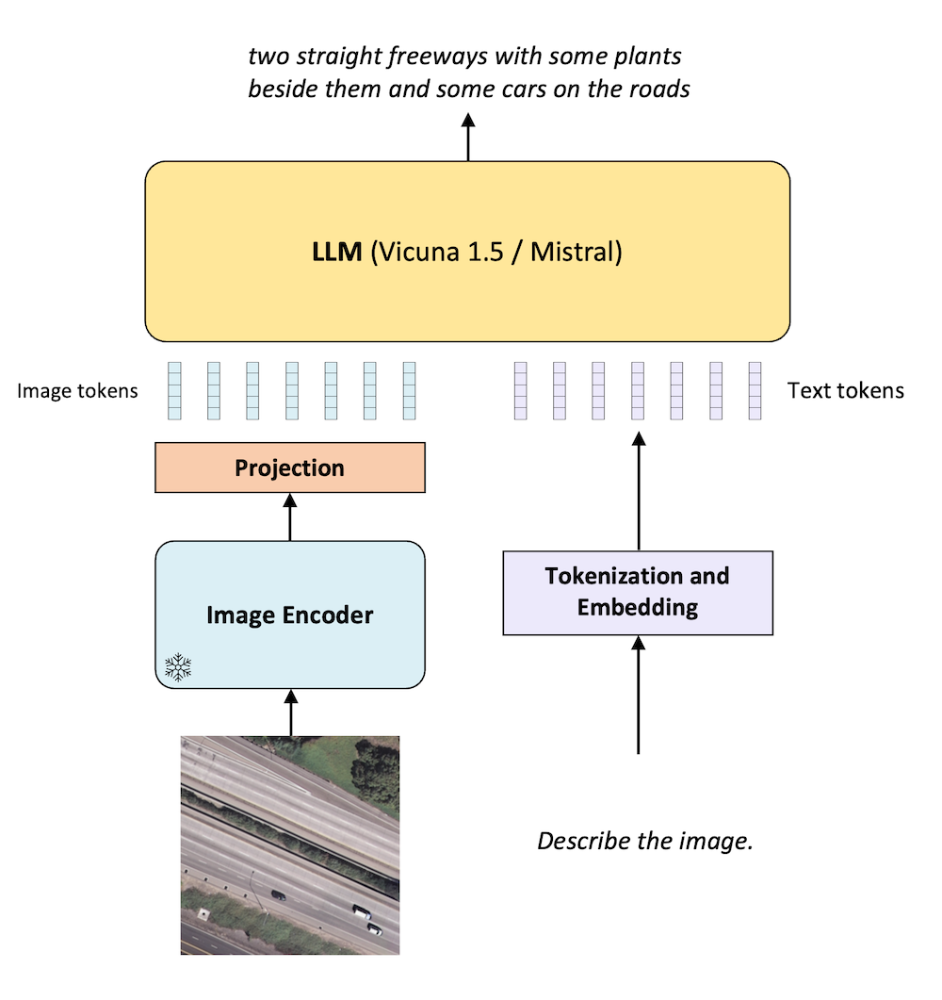

# RS-LLaVA: Large Vision Language Model for Joint Captioning and Question Answering in Remote Sensing Imagery

Yakoub Bazi, Laila Bashmal, Mohamad Al rahhal, Riccardo Ricci, Farid Melgani

---

## Content 📒
- [Latest Updates](#latest-updates)
- [Architecture](#architecture)
- [RS-Instructions Dataset](#rs-instructions-dataset)
- [Acknowledgements](#acknowledgements)
- [Citation](#citation)

---

## Latest Updates  
- ⏰ Soon: RS-instruction dataset.
- 📦 04-Apr-2024: Demo released! 🚀
  
---

## Architecture
<p align="center">
  
</p>

---

## RS-Instructions Dataset

Soon

---

## Acknowledgements
+ [LLaVA](https://github.com/haotian-liu/LLaVA).
+ [Vicuna](https://github.com/lm-sys/FastChat).

---

## Citation

```bibtex
soon

```
---
