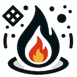

<p align="center">
  
</p>

# RS-LLaVA: Large Vision Language Model for Joint Captioning and Question Answering in Remote Sensing Imagery

Yakoub Bazi, Laila Bashmal, Mohamad Al rahhal, Riccardo Ricci, Farid Melgani


[[Paper](https://)] [[RS-LLaVA Model](https://huggingface.co/LailaMB/RS-llava-v1.5-7b-LoRA)] [[RS-instructions Dataset](https://huggingface.co/datasets/LailaMB/RS-Instructions_Dataset)]
<br>

<p align="center">

Demo:  [](https://)

Inference: [](notebook/RS_LLaVA_inference.ipynb)

</p>

## Content 📒
- [Latest Updates](#latest-updates)
- [Architecture](#architecture)
- [RS-Instructions Dataset](#rs-instructions-dataset)
- [Training](#training)
- [Acknowledgements](#acknowledgements)
- [Citation](#citation)

---

## Latest Updates  
- ⏰ Soon: RS-instruction dataset.
- 📦 20-Apr-2024: Model released! 🚀
  
---

## Architecture
<p align="center">
  
</p>

---

## RS-Instructions Dataset
<p align="center">
  
</p>

The **RS-instructions** dataset is created by combining four captioning and VQA datasets. Specifically, it includes two captioning datasets, [UCM-caption](https://pan.baidu.com/s/1mjPToHq#list/path=%2F) and UAV, as well as two VQA datasets, [RSVQA-LR](https://rsvqa.sylvainlobry.com/), and [RSIVQA-DOTA](https://github.com/spectralpublic/RSIVQA). We have utilized the same training and testing split as the original datasets. As a result, the **RS-instructions** dataset consists of 7,058 samples, with 5,506 samples in the training set and 1,552 samples in the test set.

The VQA datasets have been formatted in a conversational format. While the captioning datasets have been transformed into an instruction-answer format using a set of instructions that simply ask for a description of the image, such as "Provide a description of the image" and "What does this image represent?".


| Dataset | File | Size |
| --- | --- | --- |
UCM-caption| UCM_caption_Train.json | 2.00 MB | 
UCM-caption| UCM_caption_Test.json | 1.20 MB | 
UAV        | UAV_Train.json | 1.20 MB | 
UAV        | UAV_Test.json | 1.20 MB | 
RSVQA-LR   | RSVQA_LR_Train.json | 1.20 MB | 
RSVQA-LR   | RSVQA_LR_Test.json | 1.20 MB | 
RSIVQA-DOTA   | RSIVQA_DOTA_Train.json | 1.20 MB | 
RSIVQA-DOTA   | RSIVQA_DOTA_Test.json | 1.20 MB | 

---

## Training

Training RS-LLaVa is carried out in two stages:

#### Stage 1: Pretraining (Feature alignment) stage:
Using LAION/CC/SBU BLIP-Caption Concept-balanced 558K dataset, and two RS datasets, [NWPU](https://github.com/HaiyanHuang98/NWPU-Captions) and [RSICD](https://huggingface.co/datasets/arampacha/rsicd). 


| Dataset | Link |
| --- | --- |
|LAION/CC/SBU BLIP-Caption Concept-balanced 558K|[Link](https://github.com/haotian-liu/LLaVA/blob/main/docs/Data.md)|
|NWPU-RSICD-Pretrain|[Link](https://huggingface.co/datasets/LailaMB/RS-Instructions_Dataset/tree/main#:~:text=a%20minute%20ago-,NWPU%2DRSICD%2DPretrain.json,-16.6%20MB)|


#### Stage 2: RS Visual Instruction Tuning
To teach the model to follow instructions, we used the proposed [RS-Instructions Dataset](#rs-instructions-dataset) plus LLaVA-Instruct-150K dataset.

| Dataset | Link |
| --- | --- |
|RS-Instructions|[Link](https://huggingface.co/datasets/LailaMB/RS-Instructions_Dataset)|
|LLaVA-Instruct-150K|[Link](https://huggingface.co/datasets/liuhaotian/LLaVA-Instruct-150K)|


---

## Demo

Demo is coming soon.


---

## Acknowledgements
+ [LLaVA](https://github.com/haotian-liu/LLaVA)

---

## Citation

```bibtex
soon

```
---
