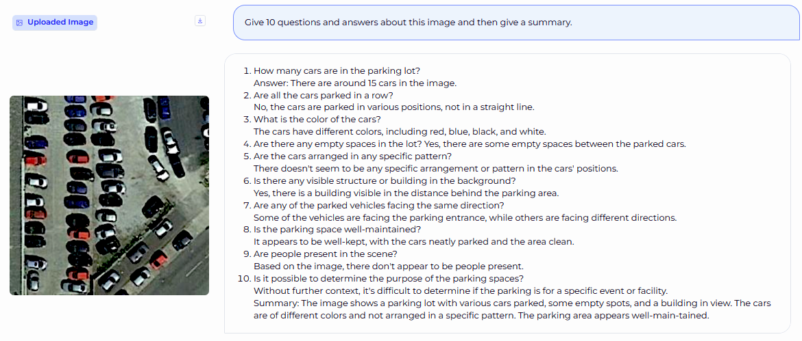
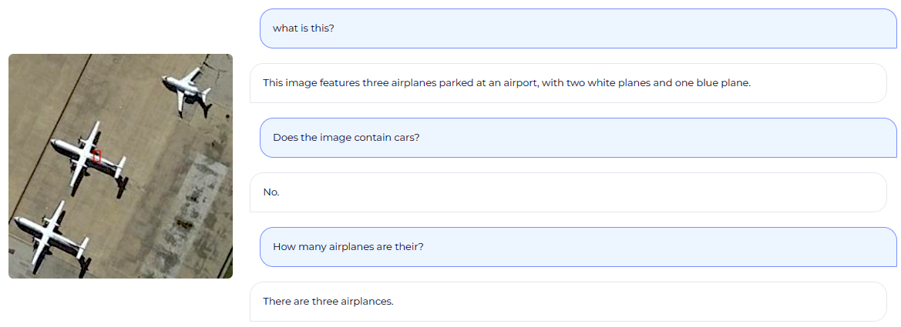
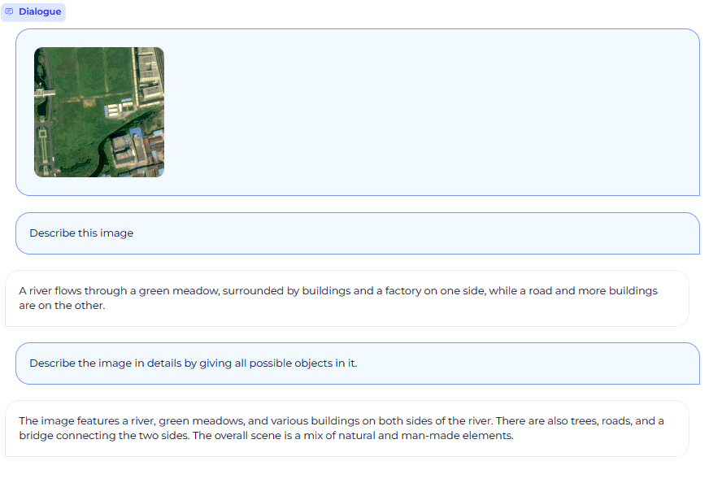

<p align="center">
  
</p>


# RS-LLaVA: Large Vision Language Model for Joint Captioning and Question Answering in Remote Sensing Imagery

Yakoub Bazi, Laila Bashmal, Mohamad Al rahhal, Mansour Zuair, Riccardo Ricci, Farid Melgani


[[Paper](https://www.mdpi.com/2072-4292/16/9/1477)] [[RS-LLaVA Model](https://huggingface.co/BigData-KSU/RS-llava-v1.5-7b-LoRA)] [[RS-instructions Dataset](https://huggingface.co/datasets/BigData-KSU/RS-instructions-dataset)] [](notebook/RS_LLaVA_inference.ipynb)

<br>

## Content 📒
- [Latest Updates](#latest-updates)
- [Architecture](#architecture)
- [Demo](#demo)
- [RS-Instructions Dataset](#rs-instructions-dataset)
- [Training](#training)
- [Install](#install)
- [Inference](#inference)
- [Acknowledgements](#acknowledgements)
- [Citation](#citation)

---

## Latest Updates  
- 📔 23 April 2024: We are excited to announce the publication of the paper [**RS-LLaVA: A Large Vision-Language Model for Joint Captioning and Question Answering in Remote Sensing Imagery**](https://www.mdpi.com/2072-4292/16/9/1477).

- 📦 20-Apr-2024: [**RS-instruction dataset**](https://huggingface.co/datasets/BigData-KSU/RS-instructions-dataset) is released.
- 📦 17-Apr-2024: [**RS-LLaVA Model**](https://huggingface.co/BigData-KSU/RS-llava-v1.5-7b-LoRA) is released and ready for use ! 🚀
  
---

## Architecture
<p align="center">
  
</p>

---
## Demo
<p align="center">
  
  
  
</p>

<p align="center">
  
  
</p>

---

## RS-Instructions Dataset
<p align="center">
  
</p>

The **RS-instructions** dataset is created by combining four captioning and VQA datasets. Specifically, it includes two captioning datasets, [UCM-caption](https://pan.baidu.com/s/1mjPToHq#list/path=%2F) and UAV, as well as two VQA datasets, [RSVQA-LR](https://rsvqa.sylvainlobry.com/), and [RSIVQA-DOTA](https://github.com/spectralpublic/RSIVQA). We have utilized the same training and testing split as the original datasets. As a result, the [RS-instructions Dataset](https://huggingface.co/datasets/BigData-KSU/RS-instructions-dataset) consists of 7,058 samples, with 5,506 samples in the training set and 1,552 samples in the test set.

The VQA datasets have been formatted in a conversational format. While the captioning datasets have been transformed into an instruction-answer format using a set of instructions that simply ask for a description of the image, such as "Provide a description of the image" and "What does this image represent?".

---

## Training

Training RS-LLaVa is carried out in three stages:

#### Stage 1: Pretraining (Feature alignment) stage:
Using LAION/CC/SBU BLIP-Caption Concept-balanced 558K dataset, and two RS datasets, [NWPU](https://github.com/HaiyanHuang98/NWPU-Captions) and [RSICD](https://huggingface.co/datasets/arampacha/rsicd). 


| Dataset | Size | Link |
| --- | --- |--- |
|CC-3M Concept-balanced 595K|211 MB|[Link](https://github.com/haotian-liu/LLaVA/blob/main/docs/Data.md)|
|NWPU-RSICD-Pretrain|16.6 MB|[Link](https://huggingface.co/datasets/BigData-KSU/RS-instructions-dataset/blob/main/NWPU-RSICD-pretrain.json)|


#### Stage 2: Visual Instruction Tuning:
To teach the model to follow instructions, we used the proposed RS-Instructions Dataset plus LLaVA-Instruct-150K dataset.

| Dataset | Size | Link |
| --- | --- |--- |
|RS-Instructions|91.3 MB|[Link](https://huggingface.co/datasets/BigData-KSU/RS-instructions-dataset/blob/main/NWPU-RSICD-UAV-UCM-LR-DOTA-intrcutions.json)|
|llava_v1_5_mix665k|1.03 GB|[Link](https://huggingface.co/datasets/liuhaotian/LLaVA-Instruct-150K/blob/main/llava_v1_5_mix665k.json)|

#### Stage 3: Downstram Task Tuning: 
In this stage, the model is fine-tuned on one of the downstream tasks (e.g., RS image captioning or VQA)

---

## Installation

1. Clone this repository and navigate to RS-LLaVA folder:

```bash
git clone [https://github.com/BigData-KSU/RS-LLaVA.git](https://github.com/BigData-KSU/RS-LLaVA.git)
cd RS-LLaVA
    git clone https://github.com/BigData-KSU/RS-LLaVA.git
    cd RS-LLaVA
```

2. Create and activate a new conda environment:

```bash
conda create -n rs-llava python=3.10 -y
conda activate rs-llava

```


3. Install PyTorch
    ```bash
    pip install torch torchvision torchaudio 

    ```

4.  Install the remaining dependencies from the `requirements.txt` file:
    ```bash
    pip install -r requirements.txt
    ```

  ```
    conda create -n rs-llava python=3.10 -y
    conda activate rs-llava
  ```


3.  Install PyTorch:
  ```bash
      pip install torch torchvision
  ```

4.  Install dependencies from the `requirements.txt` file:
  ```bash
      pip install -r requirements.txt
  ```

---

## Inference

```python 

import torch
import os
from llava.constants import IMAGE_TOKEN_INDEX, DEFAULT_IMAGE_TOKEN, DEFAULT_IM_START_TOKEN, DEFAULT_IM_END_TOKEN
from llava.conversation import conv_templates, SeparatorStyle
from llava.model.builder import load_pretrained_model
from llava.utils import disable_torch_init
from llava.mm_utils import tokenizer_image_token, get_model_name_from_path, KeywordsStoppingCriteria
from PIL import Image
import math

######## model here.................
model_path = 'BigData-KSU/RS-llava-v1.5-7b-LoRA'

model_base = 'Intel/neural-chat-7b-v3-3'

#### Further instrcutions here..........
conv_mode = 'llava_v1'
disable_torch_init()

model_name = get_model_name_from_path(model_path)
print('model name', model_name)
print('model base', model_base)


tokenizer, model, image_processor, context_len = load_pretrained_model(model_path, model_base, model_name)


def chat_with_RS_LLaVA(cur_prompt,image_name):
    # Prepare the input text, adding image-related tokens if needed
    image_mem = Image.open(image_name)
    image_tensor = image_processor.preprocess(image_mem, return_tensors='pt')['pixel_values'][0]

    if model.config.mm_use_im_start_end:
        cur_prompt = f"{DEFAULT_IM_START_TOKEN} {DEFAULT_IMAGE_TOKEN} {DEFAULT_IM_END_TOKEN}\n{cur_prompt}"
    else:
        cur_prompt = f"{DEFAULT_IMAGE_TOKEN}\n{cur_prompt}"

    # Create a copy of the conversation template
    conv = conv_templates[conv_mode].copy()
    conv.append_message(conv.roles[0], cur_prompt)
    conv.append_message(conv.roles[1], None)
    prompt = conv.get_prompt()

    # Process image inputs if provided
    input_ids = tokenizer_image_token(prompt, tokenizer, IMAGE_TOKEN_INDEX, return_tensors='pt').unsqueeze(0) .cuda()
    stop_str = conv.sep if conv.sep_style != SeparatorStyle.TWO else conv.sep2
    keywords = [stop_str]
    stopping_criteria = KeywordsStoppingCriteria(keywords, tokenizer, input_ids)

    with torch.inference_mode():
        output_ids = model.generate(
            input_ids,
            images=image_tensor.unsqueeze(0).half().cuda(),
            do_sample=True,
            temperature=0.2,
            top_p=None,
            num_beams=1,
            no_repeat_ngram_size=3,
            max_new_tokens=2048,
            use_cache=True)

    input_token_len = input_ids.shape[1]
    n_diff_input_output = (input_ids != output_ids[:, :input_token_len]).sum().item()
    if n_diff_input_output > 0:
        print(f'[Warning] {n_diff_input_output} output_ids are not the same as the input_ids')
    outputs = tokenizer.batch_decode(output_ids[:, input_token_len:], skip_special_tokens=True)[0]
    outputs = outputs.strip()

    return outputs


if __name__ == "__main__":


    print('Model input...............')
    cur_prompt='Generate three questions and answers about the content of this image. Then, compile a summary.'
    image_name='assets/example_images/parking_lot_010.jpg'


    outputs=chat_with_RS_LLaVA(cur_prompt,image_name)
    print('Model Response.....')
    print(outputs)


```

---

## Acknowledgements
+ [LLaVA](https://github.com/haotian-liu/LLaVA): an open-sourced model for vision-language assistant.

---

## Citation

If you find RS-LLaVa useful in your research or application, please consider citing using the following BibTeX:

```bibtex
@Article{rs16091477,
AUTHOR = {Bazi, Yakoub and Bashmal, Laila and Al Rahhal, Mohamad Mahmoud and Ricci, Riccardo and Melgani, Farid},
TITLE = {RS-LLaVA: A Large Vision-Language Model for Joint Captioning and Question Answering in Remote Sensing Imagery},
JOURNAL = {Remote Sensing},
VOLUME = {16},
YEAR = {2024},
NUMBER = {9},
ARTICLE-NUMBER = {1477},
URL = {https://www.mdpi.com/2072-4292/16/9/1477},
ISSN = {2072-4292},
DOI = {10.3390/rs16091477}
}

```
---
## License
This model is released under [CC BY-NC 4.0](https://creativecommons.org/licenses/by-nc/4.0/) for research purposes only.


